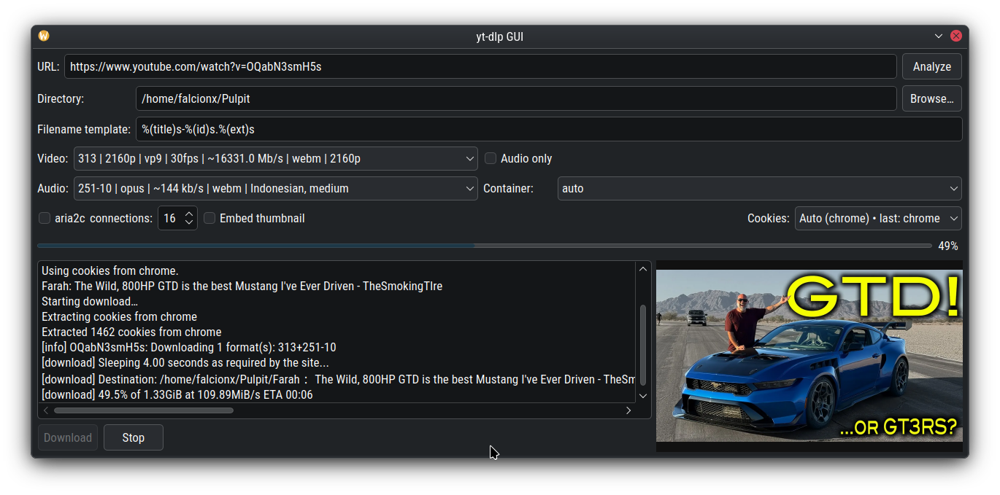

# 🎛  yt-dlp GUI

**Lightweight Qt6 frontend for `yt-dlp`** with **ffmpeg** and optional **aria2c**.
Paste a URL → see formats → download with a progress bar.

━━━━━━━━━━━━━━━━━━━━━━━━━━━━━━━━━━━━━━━━━━━━━━━━━━

## ✨ Features

```
┌─────────────────────────────────────────────────────────┐
│ 🔍 URL analysis + rich format listing (audio/video)     │
│ 🍪 Auto cookies from browser (`--cookies-from-browser`) │
│ 🖼️ Thumbnail preview                                    │
│ 🎥⬇️ Video+audio or 🔊 audio-only                       │
│ 🧩 Remux → mp4 / mkv / webm (no re-encode)              │
│ 🚀 Optional aria2c with parallel connections            │
│ 📊 Live progress bar + unified log                      │
│ 🗂️ Output folder picker & filename template             │
└─────────────────────────────────────────────────────────┘
```

## 🧰 Requirements

```
• C++17 compiler
• Qt 6 (Widgets + Network modules)
• CMake 3.16+
• Tools in PATH: yt-dlp (required) • ffmpeg (required) • aria2c (optional)
• Browser profile if the site requires sign-in
• Install Qt6 development packages plus `yt-dlp`/`ffmpeg`/`aria2c` using your package manager. On Windows, the Qt online installer works fine—just ensure the cmake toolchain sees `qmake`/`Qt6Config.cmake`.

```

## ⚙️ Build

```
cmake -S . -B build
cmake --build build
```
```
The resulting binary lives at `build/yt-dlp-gui` (or `yt-dlp-gui.exe` on Windows).
```

## ▶️ Run

```
./build/yt-dlp-gui
```

## 🪄 Usage — 3 steps

```
① Paste a URL → click “Analyze”
② Pick formats (or “Audio only”) → choose output folder/template
③ (Optional) enable aria2c / “Embed thumbnail” → “Download”
```

### 🏷 Filename template (default)

```
%(title)s-%(id)s.%(ext)s
```

## 🆘 Quick fixes

```
❗ yt-dlp: command not found   → install yt-dlp; ensure script is in PATH
❗ ffmpeg not found / silent   → install ffmpeg; add to PATH
🔐 Site needs sign-in          → log into a supported browser; uses --cookies-from-browser
🚫 No formats listed           → check URL / cookies / login
🐢 Slow downloads              → enable aria2c; increase connections (site-permitting)
```

## 🧱 How it works (short)

```
• yt-dlp via QProcess
• Analysis: -J --ignore-config --no-warnings (+ cookies when available)
• ffmpeg handles mux/remux controlled by yt-dlp
• For progressive formats, audio selector is disabled
```

## 🔐 Security

```
• Cookies aren’t copied; yt-dlp reads them locally via --cookies-from-browser
• Thumbnails come from metadata and are displayed locally
```


